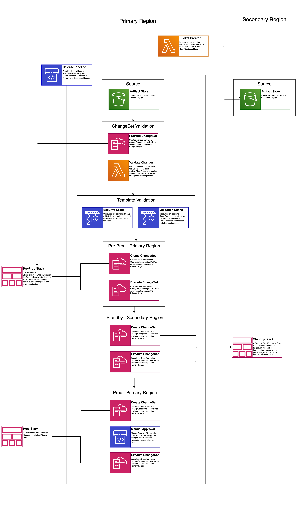

# Multi Region Application Architecture: Infrastructure Deployment

The Multi Region Application Architecture: Infrastructure Deployment Solution validates and deploys CloudFormation Templates to pre-production, secondary, and primary environments across two regions. Using this solution helps to ensure any infrastructure changes made to a primary environment are automatically deployed to a secondary environment also. Ensuring consistency across environments reduces the risk involved in shifting production traffic across regions.

## On This Page
- [Architecture Overview](#architecture-overview)
- [Creating a custom build](#creating-a-custom-build)
- [License](#license)

## Architecture Overview


At a high level, the Multi Region Infrastructure Deployment pipeline does the following steps:

1. Automatically detects changes to a source GitHub repository
2. Validates the CloudFormation template using cfn-lint and cfn_nag, and halts a deployment if either check fails
3. Verifies the CloudFormation template can be deployed to a staging, pre-production environment in the primary region
4. Deploys the CloudFormation template to the stand-by environment in the secondary region
5. Waits for manual approval before deploying the changes to the production environment in the primary region

## Creating a custom build
The solution can be deployed through the CloudFormation template available on the solution home page.
To make changes to the solution, download or clone this repo, update the source code and then run the deployment/build-s3-dist.sh script to deploy the updated Lambda code to an Amazon S3 bucket in your account.

### Prerequisites:
* [AWS Command Line Interface](https://aws.amazon.com/cli/)
* Node.js 10.x or later

### 1. Running unit tests for customization
Run unit tests to make sure added customization passes the tests:
```
cd ./deployment
chmod +x ./run-unit-tests.sh
./run-unit-tests.sh
```

### 2. Create an Amazon S3 Bucket
The CloudFormation template is configured to pull the Lambda deployment packages from Amazon S3 bucket in the region the template is being launched in. Create a bucket in the desired region with the region name appended to the name of the bucket. eg: for us-east-1 create a bucket named: `my-bucket-us-east-1`
```
aws s3 mb s3://my-bucket-us-east-1
```

### 3. Create the deployment packages
Build the distributable:
```
chmod +x ./build-s3-dist.sh
./build-s3-dist.sh my-bucket multi-region-infrastructure-deployment my-version
```

> **Notes**: The _build-s3-dist_ script expects the bucket name as one of its parameters, and this value should not include the region suffix

Deploy the distributable to the Amazon S3 bucket in your account:
```
aws s3 sync ./regional-s3-assets/ s3://my-bucket-us-east-1/multi-region-infrastructure-deployment/my-version/ 
aws s3 sync ./global-s3-assets/ s3://my-bucket-us-east-1/multi-region-infrastructure-deployment/my-version/ 
```

### 4. Launch the CloudFormation template.
* Get the link of the multi-region-infrastructure-pipeline.template uploaded to your Amazon S3 bucket.
* Deploy the Multi Region Application Architecture Solution to your account by launching a new AWS CloudFormation stack using the S3 link of the multi-region-infrastructure-pipeline.template.

## License

* This project is licensed under the terms of the Apache 2.0 license. See `LICENSE`.
* Included AWS Lambda functions are licensed under the MIT-0 license. See `LICENSE.MIT-0`.
