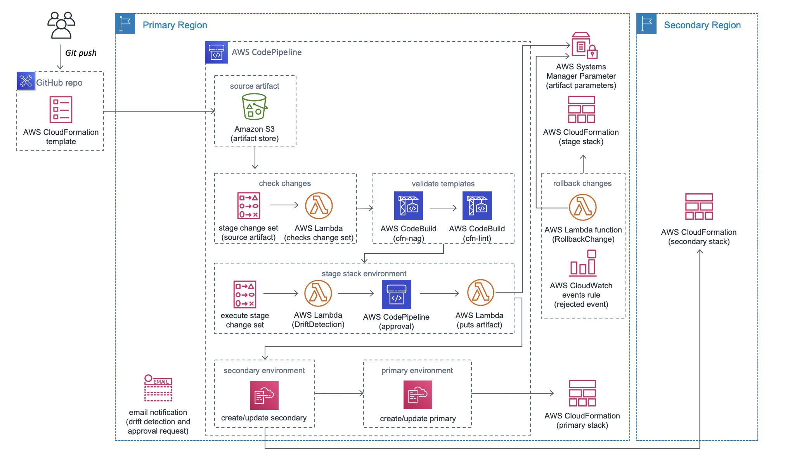

# Deprecation Notice

This AWS Solution has been archived and is no longer maintained by AWS. To discover other solutions, please visit the [AWS Solutions Library](https://aws.amazon.com/solutions/).

# Multi Region Infrastructure Deployment

The Multi Region Infrastructure Deployment Solution validates and deploys CloudFormation Templates to stage, secondary, and primary environments across two regions. Using this solution helps to ensure any infrastructure changes made to a primary environment are automatically deployed to a secondary environment also. Ensuring consistency across environments reduces the risk involved in shifting production traffic across regions.

## On This Page
- [Architecture Overview](#architecture-overview)
- [Creating a custom build](#creating-a-custom-build)
- [File Structure](#file-structure)
- [License](#license)

## Architecture Overview
### Delete the stage CloudFormation stack


### Retain the stage CloudFormation stack


At a high level, the Multi Region Infrastructure Deployment solution does the following steps:

1. Automatically detects changes to a source GitHub repository
2. Validates the CloudFormation template using cfn-lint and cfn_nag, and halts a deployment if either check fails
3. Verifies the CloudFormation template can be deployed to the stage environment in the primary region
4. Waits for manual approval; approval goes to the step 5 and rejection rolls back the changes
5. Deletes the stage environment if you set ```Yes``` to delete the stage environment when launching the solution
6. Deploys the CloudFormation template to the secondary environment in the secondary region
7. Deploys the CloudFormation template to the production environment in the primary region

## Creating a custom build
The solution can be deployed through the CloudFormation template available on the solution home page.
To make changes to the solution, download or clone this repo, update the source code and then run the deployment/build-s3-dist.sh script to deploy the updated Lambda code to an Amazon S3 bucket in your account.

### Prerequisites:
* [AWS Command Line Interface](https://aws.amazon.com/cli/)
* Node.js 12.x or later

### 1. Running unit tests for customization
Run unit tests to make sure added customization passes the tests:
```bash
cd ./deployment
chmod +x ./run-unit-tests.sh
./run-unit-tests.sh
```

### 2. Declare environment variables
```bash
export REGION=aws-region-code # the AWS region to launch the solution (e.g. us-east-1)
export DIST_OUTPUT_BUCKET=my-bucket-name # bucket where customized code will reside
export SOLUTION_NAME=my-solution-name
export VERSION=my-version # version number for the customized code
```

### 3. Create an Amazon S3 Bucket
The CloudFormation template is configured to pull the Lambda deployment packages from Amazon S3 bucket in the region the template is being launched in. Create a bucket in the desired region with the region name appended to the name of the bucket.
```bash
aws s3 mb s3://$DIST_OUTPUT_BUCKET-$REGION --region $REGION
```

### 4. Create the deployment packages
Build the distributable:
```bash
chmod +x ./build-s3-dist.sh
./build-s3-dist.sh $DIST_OUTPUT_BUCKET $SOLUTION_NAME $VERSION
```

Deploy the distributable to the Amazon S3 bucket in your account:
```bash
aws s3 sync ./regional-s3-assets/ s3://$DIST_OUTPUT_BUCKET-$REGION/$SOLUTION_NAME/$VERSION/ --recursive --acl bucket-owner-full-control
aws s3 sync ./global-s3-assets/ s3://$DIST_OUTPUT_BUCKET-$REGION/$SOLUTION_NAME/$VERSION/ --recursive --acl bucket-owner-full-control
```

### 5. Launch the CloudFormation template.
* Get the link of the multi-region-infrastructure-deployment.template uploaded to your Amazon S3 bucket.
* Deploy the Multi Region Infrastructure Deployment Solution to your account by launching a new AWS CloudFormation stack using the S3 link of the multi-region-infrastructure-deployment.template.

## File Structure
```
|-deployment/
  |-build-s3-dist.sh                             [ shell script for packaging distribution assets ]
  |-run-unit-tests.sh                            [ shell script for executing unit tests ]
  |-multi-region-infrastructure-deployment.yaml  [ solution CloudFormation deployment template ]
|-source/
  |-chageset-validator/                          [ CloudFormation stack chage set validator ]
  |-drift-detection/                             [ CloudFormation stack drift detector ]
  |-rollback-change/                             [ Rollback CloudFormation stack changes ]
  |-secondary-bucket-creator/                    [ Secondary bucket creatore ]
  |-stage-artifact-creator/                      [ Stage artifact creator ]
  |-stage-artifact-putter/                       [ Stage artifact putter ]
  |-uuid-generator/                              [ Solution UUID generator ]
```

## Collection of operational metrics
This solution collects anonymous operational metrics to help AWS improve the quality and features of the solution. For more information, including how to disable this capability, please see the [implementation guide](https://docs.aws.amazon.com/solutions/latest/multi-region-infrastructure-deployment/appendix-c.html).

## License
Multi-Region Infrastructure Deployment solution is distributed under the [Apache License, Version 2.0](https://www.apache.org/licenses/LICENSE-2.0).

See [LICENSE](./LICENSE.txt) and [NOTICE](./NOTICE.txt) for more information.
